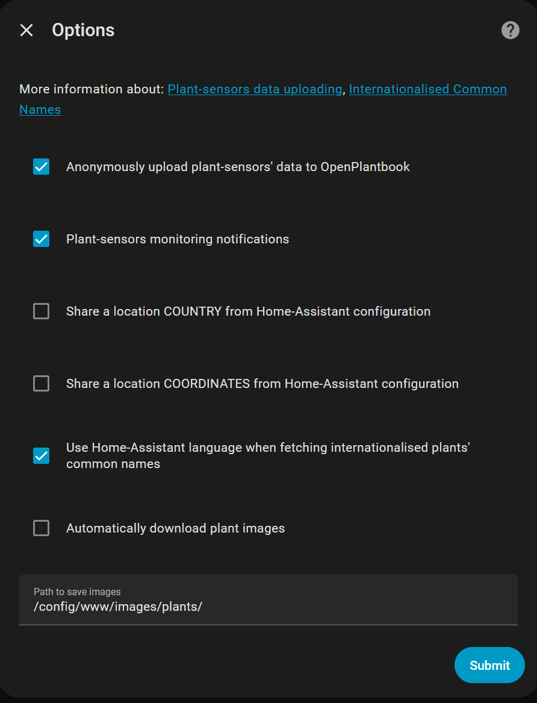
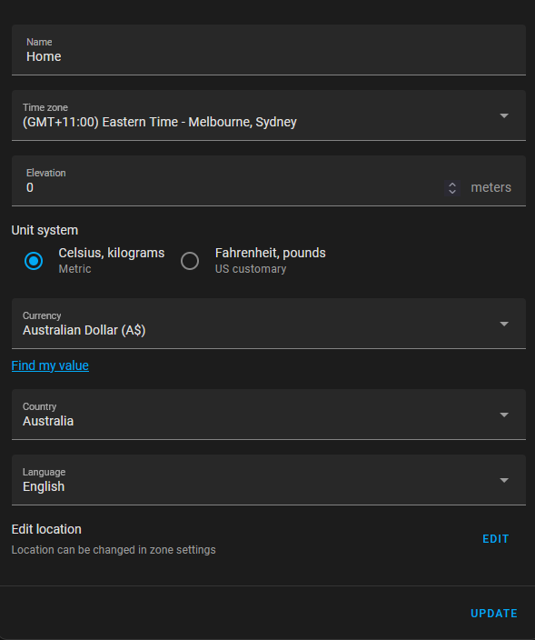
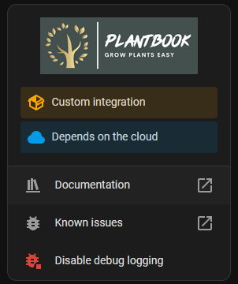

# 🌿 OpenPlantbook Integration for Home Assistant

[](https://github.com/hacs/integration)
[](https://github.com/Olen/home-assistant-openplantbook/releases)

Connects Home Assistant to the [OpenPlantbook API](https://open.plantbook.io/) for searching plant species, fetching care data, and uploading sensor readings. Used as the data backend for the [Plant Monitor](https://github.com/Olen/homeassistant-plant) integration.

---

## 📑 Table of Contents

- [🌿 OpenPlantbook Integration for Home Assistant](#-openplantbook-integration-for-home-assistant)
  - [🆕 What's New](#-whats-new)
  - [📦 Installation](#-installation)
  - [🔧 Setup](#-setup)
  - [⚙️ Configuration Options](#️-configuration-options)
    - [📤 Upload Plant Sensor Data](#-upload-plant-sensor-data)
    - [🔔 Sensors Monitoring](#-sensors-monitoring)
    - [🌍 Share Location](#-share-location)
    - [🌐 International Common Names](#-international-common-names)
    - [🖼️ Automatically Download Images](#️-automatically-download-images)
  - [📡 Actions (Service Calls)](#-actions-service-calls)
  - [🖥️ GUI Example](#️-gui-example)
  - [☕ Support](#-support)

---

## 🆕 What's New in version 1.4

- **Sensor monitoring warnings** — Stale or missing sensor updates are flagged during upload runs; details and optional notifications in [🔔 Sensors Monitoring](#-sensors-monitoring).
- **International common names** — OpenPlantbook can return common names in your Home Assistant language. See [🌐 International Common Names](#-international-common-names).

---

## 📦 Installation

### Via HACS *(recommended)*

1. Add this repo as a [Custom Repository](https://hacs.xyz/docs/faq/custom_repositories/) with type **Integration**
2. Click **Download** in the "OpenPlantbook" card in HACS
3. Restart Home Assistant

### Manual Installation

1. Copy `custom_components/openplantbook/` to your `<config>/custom_components/` directory
2. Restart Home Assistant

---

## 🔧 Setup

You need an OpenPlantbook account (free) with API credentials.

1. Register at [open.plantbook.io](https://open.plantbook.io/)
2. Find your `client_id` and `secret` at https://open.plantbook.io/apikey/show/
3. In Home Assistant: **Settings** → **Devices & Services** → **Add Integration** → **OpenPlantbook**
4. Enter your credentials — the integration validates them and shows an error if incorrect
5. Configure upload settings (optional but recommended)

---

## ⚙️ Configuration Options

After setup, click **Configure** on the integration card to access additional options.



### 📤 Upload Plant Sensor Data

> [!NOTE]
> All data is shared anonymously.

When enabled, the integration periodically (once a day) uploads sensor data from your plants to OpenPlantbook. This helps build a useful community dataset. More info: https://open.plantbook.io/ui/sensor-data/

- First upload: last 24 hours of data
- If sensors are disconnected, it retries daily for up to 7 days of historical data
- Can also be triggered manually via the `openplantbook.upload` action
- Daily uploads are scheduled at a randomized time-of-day per installation (stable for a given config entry) to even load distribution

**Configure in UI:**
- Go to **Settings** → **Devices & Services** → **OpenPlantbook** → **Configure**.
- Enable **Upload plant sensor data**.
- Enable **Plant-sensors monitoring notifications** to surface stale-sensor warnings as HA notifications (requires upload to be enabled).

### 🔔 Sensors Monitoring

Sensor monitoring runs during upload processing (scheduled daily or manual `openplantbook.upload`). For each plant sensor it:

- Looks at recorder history for the upload window and captures the latest *valid* state (ignores `unknown`/`unavailable`).
- If no valid states were found in the window, it falls back to the entity’s last known state change to determine staleness.

Warnings are emitted when:

- **Stale data**: the latest valid update is older than **24 hours**.
- **No valid data**: all recent states are `unknown`/`unavailable` and no last valid state can be determined.

If **Plant-sensors monitoring notifications** is enabled (requires upload enabled), the integration also posts a grouped Home Assistant notification per upload run, including the affected plant, each sensor entity, and the latest OpenPlantbook cloud data timestamp/age for context.

### 🌍 Share Location

Optionally share your Home Assistant location to complement sensor data. Two levels:

| Option | What is shared |
|--------|---------------|
| **Country only** | Country from HA configuration |
| **Coordinates** | Lat/lon from HA configuration |

Location is configured in HA under **Settings** → **System** → **General**.



> [!TIP]
> Enable DEBUG logging for the integration to see exactly what data is being shared.
>
> 

### 🌐 International Common Names

When enabled, the integration sends your Home Assistant language to OpenPlantbook so the API can return common names in that language when available.

[More information about this Open Plantbook feature](https://github.com/slaxor505/OpenPlantbook-client/wiki/Plant-Common-names).

### 🖼️ Automatically Download Images

Available in the integration's Options (click **Configure** after setup).

- Default path: `/config/www/images/plants`
- Specify any directory the HA user has write access to
- Relative paths are relative to your config directory

**Path behavior:**
- If the path contains `www/` → `image_url` is replaced with a `/local/` reference
- If the path does **not** contain `www/` → the full OpenPlantbook URL is kept

> [!NOTE]
> Existing files are never overwritten. The target directory must exist before configuring.

---

## 📡 Actions (Service Calls)

### `openplantbook.search`

Search for plants matching a string:

```yaml
action: openplantbook.search
data:
  alias: Capsicum
```

Read results from `openplantbook.search_result`:

```jinja2
Number of plants found: {{ states('openplantbook.search_result') }}

  
  * {{ pid }} -> {{ name }}

```

**Example output:**

```
Number of plants found: 40
  * capsicum annuum -> Capsicum annuum
  * capsicum baccatum -> Capsicum baccatum
  * capsicum chinense -> Capsicum chinense
  (...)
```

### `openplantbook.get`

Get detailed data for a single species:

```yaml
action: openplantbook.get
data:
  species: capsicum annuum
```

> [!NOTE]
> The species string must match exactly the `pid` returned by `openplantbook.search`.

Read results from `openplantbook.capsicum_annuum`:

```jinja2
Details for plant {{ states('openplantbook.capsicum_annuum') }}
* Max moisture: {{ state_attr('openplantbook.capsicum_annuum', 'max_soil_moist') }}
* Min moisture: {{ state_attr('openplantbook.capsicum_annuum', 'min_soil_moist') }}
* Max temperature: {{ state_attr('openplantbook.capsicum_annuum', 'max_temp') }}
* Image: {{ state_attr('openplantbook.capsicum_annuum', 'image_url') }}
```

### `openplantbook.upload`

Manually trigger uploading of plant sensor data:

```yaml
action: openplantbook.upload
```

Returns `null` if nothing was uploaded or an error occurred. Check the HA log for details.

---

## 🖥️ GUI Example

An example of using the actions to build a plant search UI in Home Assistant:


> [!NOTE]
> This UI is **not** part of the integration — it's an example of what you can build with the actions.

For a full walkthrough with helpers, automations, and Lovelace cards, see **[examples/GUI.md](examples/GUI.md)**.

---

## ☕ Support

* Olen's work by 
<a href="https://www.buymeacoffee.com/olatho" target="_blank">

</a>

* Open Plantbook by adding a new plant to its data base and sharing your sensors data.

