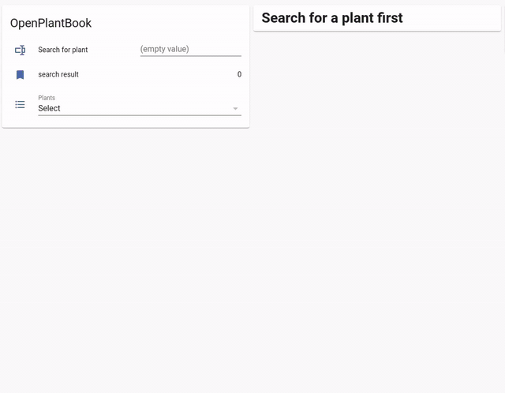

# 🖥️ Example: Plant Search GUI

Build a simple plant search interface in Home Assistant using OpenPlantbook actions, helpers, and Lovelace cards.



> [!NOTE]
> This UI is **not** part of the integration — it's an example of what you can build with the OpenPlantbook actions.

---

## 📑 Table of Contents

- [🖥️ Example: Plant Search GUI](#️-example-plant-search-gui)
  - [📋 Helpers](#-helpers)
  - [⚙️ Automations](#️-automations)
  - [🃏 Lovelace Cards](#-lovelace-cards)

---

## 📋 Helpers

Create these helpers to store search results and trigger the automations. You can create them via YAML or in the UI under **Settings** → **Devices & Services** → **Helpers**.

### Input Text — Search Field

```yaml
input_text:
  openplantbook_search:
    name: Search OpenPlantbook
```

### Input Select — Search Results Dropdown

```yaml
input_select:
  openplantbook_searchresults:
    name: Openplantbook Search Results
    options:
      - "Search first"
```

### Input Button — Clear Cache

```yaml
input_button:
  openplantbook_clear_cache:
    name: Clear Openplantbook Cache
```

---

## ⚙️ Automations

These automations wire the helpers to the OpenPlantbook actions.

### 🔍 Search When Text Changes

Triggers a search whenever the search field is updated:

```yaml
alias: Search Openplantbook
triggers:
  - trigger: state
    entity_id: input_text.openplantbook_search
actions:
  - action: openplantbook.search
    data:
      alias: "{{ states('input_text.openplantbook_search') }}"
```

### 📋 Populate Dropdown with Results

Fills the dropdown when search results arrive:

```yaml
alias: Populate Openplantbook Dropdown
triggers:
  - trigger: state
    entity_id: openplantbook.search_result
actions:
  - action: input_select.set_options
    data:
      entity_id: input_select.openplantbook_searchresults
      options: |
        
          {{ states.openplantbook.search_result.attributes | list }}
        
          [ "No plants found"]
        
```

### 🌱 Fetch Details on Selection

Gets full plant data when a species is selected from the dropdown:

```yaml
alias: Get Info From Openplantbook
triggers:
  - trigger: state
    entity_id: input_select.openplantbook_searchresults
actions:
  - action: openplantbook.get
    data:
      species: "{{ states('input_select.openplantbook_searchresults') }}"
```

### 🗑️ Clear Cache on Button Press

```yaml
alias: Clear Openplantbook cache
triggers:
  - trigger: state
    entity_id: input_button.openplantbook_clear_cache
actions:
  - action: openplantbook.clean_cache
    data:
      hours: 0
```

---

## 🃏 Lovelace Cards

Two cards: one for searching, one for displaying plant details.

### Search Card

```yaml
type: entities
title: Search OpenPlantbook
entities:
  - entity: input_text.openplantbook_search
  - entity: openplantbook.search_result
  - entity: input_select.openplantbook_searchresults
  - entity: input_button.openplantbook_clear_cache
```

### Plant Info Card

A Markdown card that shows the selected plant's image, species, and thresholds:

```yaml
type: markdown
title: Plant info
content: |
  
  
  # Search for a plant
  
  # {{ state_attr(plant, 'display_pid') }}
  
  

   | urlencode }})

  _{{ state_attr(plant, 'pid') }}_

  ## Thresholds

  |                      | Min                                       |    | Max                                       |      |
  |----------------------|------------------------------------------:|----|------------------------------------------:|------|
  | Moisture             | {{ state_attr(plant, 'min_soil_moist') }} |    | {{ state_attr(plant, 'max_soil_moist') }} | %     |
  | Conductivity         | {{ state_attr(plant, 'min_soil_ec') }}    |    | {{ state_attr(plant, 'max_soil_ec') }}    | μS/cm |
  | Temperature          | {{ state_attr(plant, 'min_temp') }}       |    | {{ state_attr(plant, 'max_temp') }}       | °C    |
  | Humidity             | {{ state_attr(plant, 'min_env_humid') }}  |    | {{ state_attr(plant, 'max_env_humid') }}  | %     |
  | Illumination         | {{ state_attr(plant, 'min_light_lux') }}  |    | {{ state_attr(plant, 'max_light_lux') }}  | lx    |
  | Daily Light Integral | {{ min_dli }}                             |    | {{ max_dli }}                             | mol/d⋅m² |
  
```
